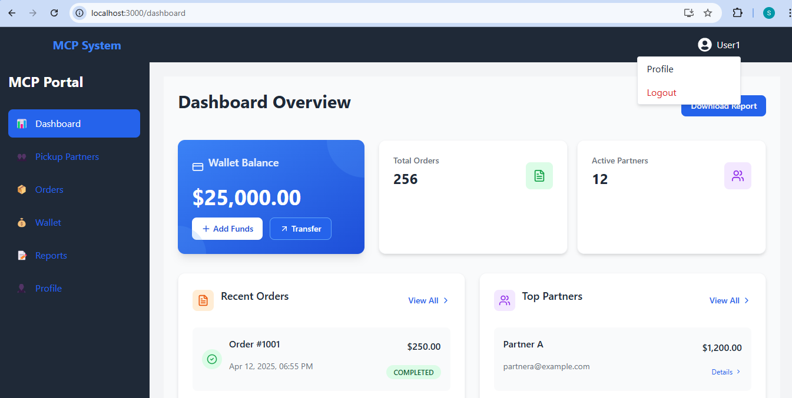
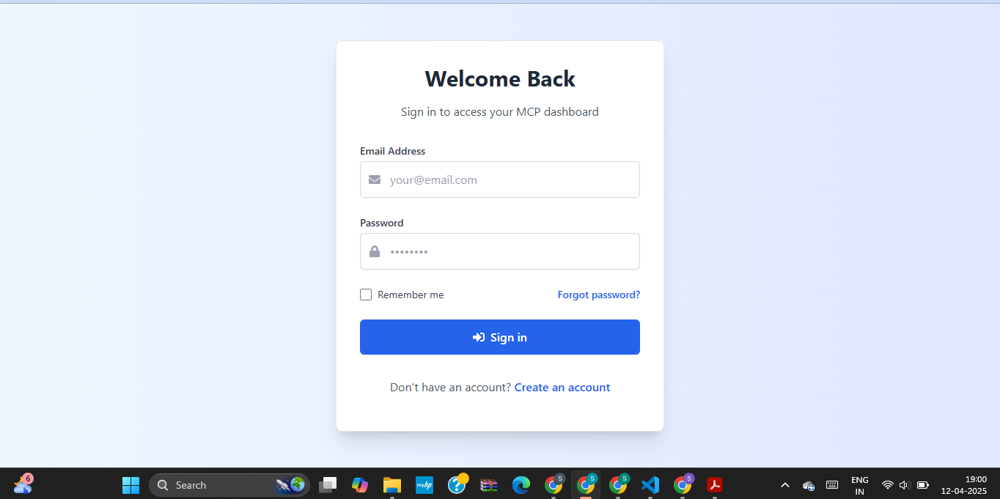
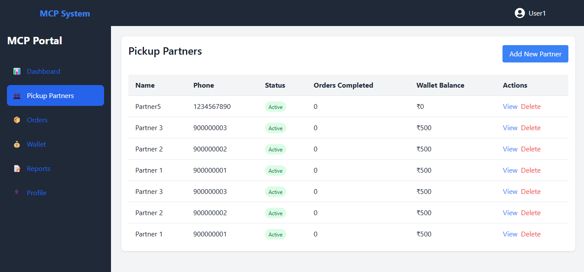

# MCP System - Micro Collection Partner

A full-stack web dashboard that enables MCPs to manage pickup partners, assign orders, view transactions, and handle wallet-based fund transfers in real-time.

This platform supports authentication, user-based wallets, and order management — all within a clean, responsive dashboard UI.





---

## 🚀 Features

- 🔐 User authentication with secure JWT cookies
- 🧑 MCP wallet: view balance, transfer funds, add funds
- 🛵 Assign orders to pickup partners
- 🧾 View and filter transaction history
- 📊 Real-time stats on partners, orders, and earnings
- 📁 Fully modular backend with Express.js and MongoDB

---

## 🛠️ Tech Stack

| Frontend                  | Backend                 | Database     |
|--------------------------|-------------------------|--------------|
| React + Tailwind         | Node.js + Express       | MongoDB + Mongoose |
| React Router DOM         | JWT + Cookie Auth       |              |
| Shadcn UI + Radix UI     | RESTful API architecture|              |
| Axios                    | dotenv + cors + helmet  |              |

---

## ⚙️ Setup Instructions

### 1. 📥 Clone the repo
```bash
git clone https://github.com/your-username/mcp-system.git
cd mcp-system
```

### 2. 🔧 Backend Setup
```bash
cd backend
npm install

# Create .env
cp .env.example .env

# Update with Mongo URI and JWT secret
MONGO_URI=mongodb://localhost:27017/mcp
JWT_SECRET=your_secret_key

# Start server
npm start
```

### 3. 💻 Frontend Setup
```bash
cd frontend
npm install

# Create .env
cp .env.example .env

# Set API base URL
REACT_APP_API_URL=http://localhost:5000/api

# Start frontend
npm start
```

### 4. 🧪 Seed Initial Data
```bash
cd backend
node seeders/index.js
```

> This seeds MCP user, partners, wallet, and sample orders.

---

## 📸 Screenshots


| Dashboard | Login | Pickup Partners |
|----------|--------|-----------------|
|  |  |  |


---

## Future Improvements

- ✅ **Admin Panel** for platform-level user control
- ✅ **Withdraw Requests** via banking API integration
- ✅ **Payment Gateway Integration** for Add Funds (Razorpay/Stripe)
- ✅ **PDF Export** of transaction history and reports
- ✅ **Email Notifications** on fund transfers and order completion
- ✅ **Deployment** via:
  - 🌐 Frontend: [Vercel](https://vercel.com) or [Netlify](https://netlify.com)
  - 🚀 Backend: [Render](https://render.com), [Railway](https://railway.app)
